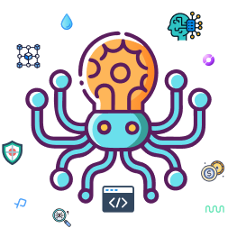

# Nixora AI

A modern web application built with Next.js 14, integrating AI capabilities and blockchain features using the Sui network.



## 🚀 Tech Stack

- **Framework:** Next.js 14 (App Router)
- **UI Components:**
  - Shadcn UI
  - Radix UI Primitives
  - Tailwind CSS for styling
  - Framer Motion for animations
- **State Management & Data Fetching:**
  - TanStack Query (React Query) v5
- **AI Integration:**
  - Langchain/Ollama
  - OpenAI
  - Tavily Core
- **Blockchain Integration:**
  - Sui Network (@mysten/sui.js)
  - Suiet Wallet Kit
- **Icons & UI Elements:**
  - Phosphor Icons
  - Lucide React
- **Markdown Support:**
  - React Markdown
  - Remark GFM

## ✨ Features

- Modern, responsive UI with micro-interactions and animations
- AI-powered functionality using multiple AI providers
- Blockchain integration with Sui Network
- Real-time data updates and caching with TanStack Query
- Markdown content support
- Toast notifications and tooltips
- Auto-resizing text areas
- Responsive avatar components
- Dropdown menus and custom UI elements

## 🛠 Getting Started

1. **Clone the repository:**

   ```bash
   git clone <repository-url>
   cd nixora
   ```

2. **Install dependencies:**

   ```bash
   npm install
   # or
   yarn install
   # or
   pnpm install
   ```

3. **Set up environment variables:**
   Create a `.env` file in the root directory and add necessary environment variables.

4. **Run the development server:**

   ```bash
   npm run dev
   # or
   yarn dev
   # or
   pnpm dev
   ```

5. Open [http://localhost:3000](http://localhost:3000) with your browser to see the result.

## 🔧 Development

- The project follows a modular architecture with components organized in the `components/` directory
- Styles are primarily handled through Tailwind CSS
- Custom hooks are available in the `hooks/` directory
- Utility functions and configurations are stored in the `lib/` directory

## 📦 Project Structure

```
nixora/
├── app/                # Next.js app router pages and layouts
├── components/         # Reusable UI components
├── hooks/             # Custom React hooks
├── lib/               # Utility functions and configurations
├── public/            # Static assets
└── providers.js       # React context providers
```

## 🚀 Deployment

The application is optimized for deployment on Vercel. For other platforms, ensure proper environment variable configuration and build settings.

## 📝 License

This project is licensed under the MIT License - see the LICENSE file for details.

## 🤝 Contributing

Contributions, issues, and feature requests are welcome!
