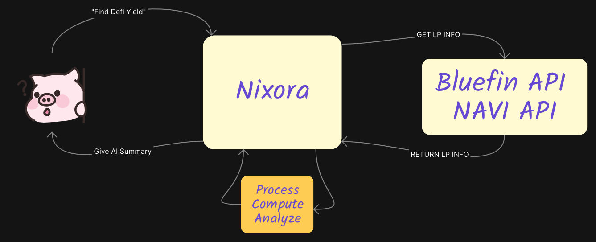

<h1 align="center" style="font-size: 4em;">𝙽𝙸𝚇𝙾𝚁𝙰 𝙰𝙸</h1>

<p align="center">
  
</p>

<br />

# Nixora

A full-stack DeFi AI Agent starter kit. Nixora comes with numerous components and features to allow users build, interact and deploy their own DeFi AI agent on the Sui blockchain within minutes. Powered by open source models running locally via Ollama or Atoma Network. Private, secure, trusted execution environment (TEE).

> **⚠️ NOTE:** This is a submission into the SUI AI agent hackathon, the last commit time was past the deadline only to include demo link to video. The delay video submission was due to Atoma infra issues near deadline.. talked to a few Atoma members.. please accept my submission ^\_^

**Demo Video:** [Download From Google Drive](https://drive.google.com/file/d/1UbAWDoMikVb6WXm-1WaN83xvY0--fVPv/view?usp=drive_link)

<div style="overflow-x: auto; white-space: nowrap; padding: 10px 0;">
  
  
  
  
  
</div>

## Why I built Nixora

I built Nixora to allow users a quick and easy way to get started with AI agents. Previously, I was discouraged in building AI agents due to the growing AI compute cost, and lack of privacy. Building and iterating with AI agents gets expensive quickly when relaying on third party AI compute providers, and I wanted to make it easier for users to get started.

Nixora allows you to build, iterate and test your AI agent locally, without any third parties involved or outside network connections, private and unlimited request to local LLM(s) running via Ollama. This gives the developer freedom to test and iterate wouldn't worrying about a growing bill.

Included with everything you need to focus on building, iterating and testing your AI agent.

On deployment, users can easily switch AI compute provider from local to Atoma Network with a simple environment variable change. Atoma is a decentralized AI compute provider that allows users to run LLM(s) in a private, secure, and trusted execution environment (TEE).

## 🛠 Agent Tools / Capabilities

<p align="center">
  
</p>

- Reasoning / Logic (LLM)
  - Llama 3.3 70B Instruct
  - DeepSeek-R1
  - Qwen2.5 3B
- Crypto Price Search
  - CryptoCompare API
  - ask: `What is the price of SUI?`
- Internet Search
  - Tavily Search API
  - ask: `Search superbowl winner 2025?`
- DeFi Yield Search / Analysis
  - NAVI API
  - Bluefin API
  - ask: `find defi yield`
- Transfer Sui To Wallet
  - Suiet Wallet Kit
  - ask: `send 0.69 sui to 0x069bd5e649525777e5da73c151ff87ac4e82583ca4a5badb3dcab0b2c29c0656`

## API(s)

<p align="center">
  
</p>

### NAVI Protocol Integration

```http
GET /api/navi
```

This endpoint interacts with NAVI Protocol's API to retrieve comprehensive liquidity pool data. The data is then analyzed by Nixora AI agent to:

- Identify optimal yield farming opportunities
- Calculate potential returns and APY
- Assess pool stability and risks
- Monitor liquidity depth and trading volume
- Track historical performance metrics

#### Sample Response

```json
{
  "success": true,
  "analysis": "**Navi Protocol Analysis**\n\n1. **Highest Yield Farming (Supply) Opportunities**: The top three assets for yield farming on Navi Protocol are NS (28.863% APY), DEEP (22.241% APY), and NAVX (18.743% APY). These assets offer the highest supply APYs, making them attractive for users looking to maximize their yield.\n2. **Lowest Borrowing Rates**: The assets with the lowest borrowing rates on Navi Protocol are BTC (0.466% APY), CERT (0.843% APY), and HASUI (0.224% APY). These low borrowing rates make them ideal for users who need to borrow assets for trading or other purposes.\n3. Potocol's lending markets and Bluefin's DEX, users can identify arbitrage opportunities. For example, if the price of an asset is higher on Bluefin's DEX than on Navi Protocol, users can buy the asset on Navi Protocol and sell it on Bluefin's DEX, earning a profit from the price difference.\n\nView all Navi markets at https://app.naviprotocol.io/market\nExplore Bluefin's DEX at https://bluefin.io",
  "timing": {
    "total": 6100.980133000063,
    "dataProcessing": 0.0742629999294877,
    "aiAnalysis": 6097.904188999906
  }
}
```

### Bluefin Integration

```http
GET /api/bluefin
```

This endpoint interfaces with Bluefin's API to fetch real-time liquidity pool data and market insights. The data is analyzed by Nixora AI agent to:

- Monitor trading opportunities across spot and perpetual markets
- Analyze market depth and liquidity
- Track price movements and volatility
- Identify potential arbitrage opportunities
- Calculate trading fees and potential slippage

#### Sample Response

```json
{
  "success": true,
  "data": [
    {
      "symbol": "suiUSDT/USDC",
      "tvl": "16972610.750106346357215",
      "dayStats": {
        "apr": {
          "total": "28.5039748739",
          "feeApr": "6.9764253",
          "rewardApr": "21.5275495739"
        },
        "volume": "32440584.593327047983354",
        "priceRange": {
          "min": "0.999714609",
          "max": "1.000270619"
        }
      },
      "weekStats": {
        "apr": {
          "total": "24.236259986",
          "feeApr": "2.76769",
          "rewardApr": "21.468569986"
        },
        "volume": "90336356.058227410852185"
      },
      "currentPrice": "0.999787666",
      "tokens": {
        "tokenA": {
          "symbol": "suiUSDT",
          "amount": "4322814255705"
        },
        "tokenB": {
          "symbol": "USDC",
          "amount": "12674712061885"
        }
      },
      "rewards": [
        {
          "token": "BLUE",
          "dailyRewardsUsd": "1616.8133672472789504"
        },
        {
          "token": "stSUI",
          "dailyRewardsUsd": "8393.562504590914944"
        }
      ]
    },
    {
      "symbol": "stSUI/USDC",
      "tvl": "889799.353530276596783576",
      "dayStats": {
        "apr": {
          "total": "111.8216636",
          "feeApr": "109.5212448",
          "rewardApr": "2.3004188"
        },
        "volume": "5339827.824026051669745192",
        "priceRange": {
          "min": "2.858779241",
          "max": "3.196590165"
        }
      },
      "weekStats": {
        "apr": {
          "total": "212.6746199",
          "feeApr": "210.3805036",
          "rewardApr": "2.2941163"
        },
        "volume": "71998585.313332665645604048"
      },
      "currentPrice": "3.14042285",
      "tokens": {
        "tokenA": {
          "symbol": "stSUI",
          "amount": "229581222922007"
        },
        "tokenB": {
          "symbol": "USDC",
          "amount": "168213112366"
        }
      },
      "rewards": [
        {
          "token": "BLUE",
          "dailyRewardsUsd": "56.0797584018805152"
        }
      ]
    }
  ],
  "analysis": "**DeFi Liquidity Pools Analysis on Bluefin**\n\n### 1. Overview\n\nThe top 5 liquidity pools on Bluefin have varying TVLs, with the suiUSDT/USDC pool having the highest TVL at $16,972,610.75, followed by the SUI/USDC pool at $8,134,226.78. The DEEP/SUI pool has the lowest TVL at $2,483,852.43. Trading conditions also differ, with the SUI/USDC pool having the highest daily volume at $8,491,040.76, while the wUSDT/USDC pool has the lowest at $6,227,362.20.\n\n### 2. APR Analysis\n\nThe DEEP/SUI pool has the highest total APR at 277.84%, with a fee APR of 190.29% and a reward APR of 87.55%. The SUI/USDC pool has the second-highest total APR at 116.95%, with a fee APR of 76.20% and a reward APR of 40.75%. The wUSDT/USDC pool has the lowest total APR at 18.59%, with a fee APR of 7.28% and a reward APR of 11.31%.\n\n### 3. Risk Assessment\n\nPrice stability varies across pools, with the wUSDT/USDC pool having the most stable price range (0.999814796 - 1.000346352). The DEEP/SUI pool has the most volatile price range (0.055930582 - 0.058670431). The SUI/USDC pool has a relatively stable price range (2.890277601 - 3.176872803).\n\n### 4. Recommendation\n\nBased on TVL, APR, and risk metrics, the ranking of the pools is:\n1. SUI/USDC: High TVL, high APR, and relatively stable price range.\n2. suiUSDT/USDC: High TVL, moderate APR, and stable price range.\n3. DEEP/SUI: Low TVL, high APR, but volatile price range.\n4. wUSDT/USDC: Low TVL, low APR, but stable price range.\n5. stSUI/USDC: Low TVL, high APR, but relatively stable price range.\n\nTo view more details on these liquidity pools and make informed investment decisions, visit the [Bluefin trading platform](https://trade.bluefin.io/liquidity-pools)."
}
```

## 🤖 Tech Stack

- **Framework:** Next.js 14 (App Router) React 18
- **Language:** JavaScript
- **Deployment:** Vercel
- **Blockchain Integration:**
  - Sui Network (@mysten/sui.js)
  - Suiet Wallet Kit
- **AI Integration:**
  - Atoma Network
    - [Llama 3.3 70B Instruct](https://ollama.com/library/llama3.3:70b)
    - [DeepSeek-R1](https://ollama.com/library/deepseek-r1)
  - Ollama
    - [qwen2.5:1.5b](https://ollama.com/library/qwen2.5:1.5b)
- **DeFi:**
  - NAVI
  - Bluefin
  - CryptoCompare
- **UI Components:**
  - Shadcn UI
  - Radix UI Primitives
  - Tailwind CSS for styling
  - Framer Motion for animations
- **State Management & Data Fetching:**
  - TanStack Query (React Query) v5

## ✨ Features

- AI Integration (Atoma Network, Ollama)
  - Llama3.3 70B Instruct
  - DeepSeek-R1
- Sui wallet integration
- Interact with AI agent via chat UI/UX
- AI compute in private, secure, trusted execution environment (TEE)
- AI agent tools:
  - Crypto Price Search
  - Internet Search
  - DeFi Yield Search / Analysis
  - Send Sui to wallet
- Real-time data updates and caching with TanStack Query

## 🛠 Getting Started

1. **Clone the repository:**

   ```bash
   git clone https://github.com/leche64/nixora.git
   cd nixora
   ```

2. **Install dependencies:**

   ```bash
   npm install
   # or
   yarn install
   # or
   pnpm install
   ```

3. **Set up environment variables:**
   Create a `.env` file in the root directory and add necessary environment variables.

   ```env
      NEXT_PUBLIC_APP_URL=http://localhost:3000

      # OPTIONS:
      # TESTNET
      # MAINNET
      # <ANY AI COMPUTE PROVIDER>
      SUI_NETWORK=TESTNET

      # OPTIONS:
      # http://localhost:11434/v1 (OLLAMA)
      # https://api.atoma.network/v1 (ATOMA)
      # https://api.openai.com/v1 (OPENAI)
      # <ANY AI COMPUTE PROVIDER>
      LLM_BASE_URL=http://localhost:11434/v1

      # OPTIONS:
      # "ollama" (DEFAULT)
      # Retrieve API Key from LLM Provider
      LLM_API_KEY=XXXXXXXXXX

      # OPTIONS:
      # PROD = ATOMA (AI Compute Provider) "meta-llama/Llama-3.3-70B-Instruct" + "deepseek-ai/DeepSeek-R1"
      # LOCAL = OLLAMA (LOCAL) "qwen2.5:3b" download from: https://ollama.com/library/qwen2.5:3b
      LLM_ENV=LOCAL

      # Tavily API for internet search
      # Get your API key at https://app.tavily.com/home
      TAVILY_API_KEY=XXXXXXXXXX
   ```

4. **Run the development server:**

   ```bash
   npm run dev
   # or
   yarn dev
   # or
   pnpm dev
   ```

5. Open [http://localhost:3000](http://localhost:3000) with your browser to see the result.

## 🕵️ Full Privacy & Security

> Nixora is built with privacy and security in mind. No data is ever logged or stored on the server and there is no database within this app. All data is stored locally on your device and AI compute is processed either by Ollama (locally) or Atoma Network (decentralized cloud).

### Run Local for maximum privacy

1. Set Environment Variables For Local settings / LLM(s)
   ```
   LLM_BASE_URL=http://localhost:11434/v1
   LLM_API_KEY=ollama
   LLM_ENV=LOCAL
   ```
2. Download Ollama from https://ollama.com/download
3. Download the model of your choice from https://ollama.com/library
   - The most performant model for tool calling on modest hardware I've found to be [qwen2.5:1.5b](https://ollama.com/library/qwen2.5:1.5b)
     - 2 GHz Quad-Core Intel Core i5 - 16 GB 3733 MHz LPDDR4X
4. Run the model locally via Ollama, this automatically starts the Ollama server and exposes the API at `http://localhost:11434/v1` on your machine that any local app (terminal, UI, etc.) can make API calls to.
   ```bash
   ollama run qwen2.5:1.5b
   ```
5. Running LLM(s) locally means you talk directly to the model(s) without any third parties involved or outside network connections, unlimited.. FOR FREE.

## 🔗 Useful Links

- [Sui Developer Portal](https://sui.io/developers#dev-tools) - Official Sui development resources and tools
- [Suiet Wallet Kit](https://github.com/suiet/wallet-kit) - React wallet adapter for Sui blockchain
- [NAVI Protocol](https://naviprotocol.gitbook.io/navi-protocol-developer-docs/navi-api-collection/navi-api) - DeFi protocol on Sui
- [Bluefin](https://bluefin-exchange.readme.io/reference/spot-api-introduction) - DeFi protocol on Sui
- [Atoma Network](https://atoma.network/) - Decentralized AI private cloud
- [Ollama](https://ollama.com/) - Local AI models
- [Open LLM Leaderboard](https://huggingface.co/spaces/open-llm-leaderboard/open_llm_leaderboard#/?params=3%2C7&official=true) - Compare performance of open source LLMs

## 📝 License

This project is licensed under the MIT License - see the LICENSE file for details.
