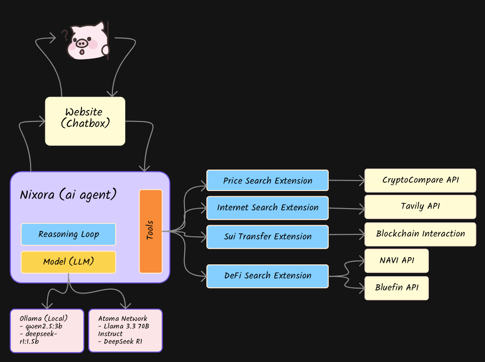

<h1 align="center" style="font-size: 3em;">𝙽𝙸𝚇𝙾𝚁𝙰 𝙰𝙸</h1>

<p align="center">
  
</p>

A full-stack DeFi AI Agent starter kit. Nixora is a powerful AI agent that comes with numerous tools and features to help users build, interact and deploy their own DeFi AI agent on Sui blockchain within minutes. Powered by open source models ran locally via Ollama or Atoma Network.

<div style="overflow-x: auto; white-space: nowrap; padding: 10px 0;">
  
  
  
  
  
</div>

## 🛠 Agent Tools / Capabilities

<p align="center">
  
</p>

- Crypto Price Search
  - CryptoCompare API
- Internet Search
  - Tavily Search API
- DeFi Yield Search / Analysis
  - NAVI API
  - Bluefin API
- Transfer Sui To Wallet

## API(s)

### NAVI Protocol Integration

```http
GET /api/navi
```

This endpoint interacts with NAVI Protocol's API to retrieve comprehensive liquidity pool data. The data is then analyzed by Nixora AI agent to:
- Identify optimal yield farming opportunities
- Calculate potential returns and APY
- Assess pool stability and risks
- Monitor liquidity depth and trading volume
- Track historical performance metrics

#### Sample Response

```json
{
  "success": true,
  "analysis": "**Navi Protocol Analysis**\n\n1. **Highest Yield Farming (Supply) Opportunities**: The top three assets for yield farming on Navi Protocol are NS (28.863% APY), DEEP (22.241% APY), and NAVX (18.743% APY). These assets offer the highest supply APYs, making them attractive for users looking to maximize their yield.\n2. **Lowest Borrowing Rates**: The assets with the lowest borrowing rates on Navi Protocol are BTC (0.466% APY), CERT (0.843% APY), and HASUI (0.224% APY). These low borrowing rates make them ideal for users who need to borrow assets for trading or other purposes.\n3. **Best Risk-Adjusted Returns considering LTV ratios**: Considering the LTV ratios, the top assets for risk-adjusted returns are BUCK (13.195% APY, 0.7 LTV), USDT (11.342% APY, 0.7 LTV), and FDUSD (10.364% APY, 0.7 LTV). These assets offer a balance between yield and collateral requirements.\n\n**Bluefin.io Trading Opportunities**\n\n1. **Perpetual Futures Trading**: With the launch of perpetual futures trading on Bluefin's DEX in Q1 2025, users can expect to trade popular assets like BTC, ETH, and NS with high leverage and low fees.\n2. **Spot Trading with Cross-Chain Liquidity**: Bluefin's DEX offers spot trading with cross-chain liquidity, allowing users to trade assets across different blockchain networks. This feature enables users to access a broader range of assets and liquidity pools.\n3. **Sub-Second Transaction Execution**: Bluefin's high-performance DEX ensures fast and efficient transaction execution, making it ideal for traders who require quick execution and low latency.\n\n**Cross-Platform Arbitrage Potential**\n\nBy monitoring price discrepancies between Navi Protocol's lending markets and Bluefin's DEX, users can identify arbitrage opportunities. For example, if the price of an asset is higher on Bluefin's DEX than on Navi Protocol, users can buy the asset on Navi Protocol and sell it on Bluefin's DEX, earning a profit from the price difference.\n\nView all Navi markets at https://app.naviprotocol.io/market\nExplore Bluefin's DEX at https://bluefin.io",
  "timing": {
    "total": 6100.980133000063,
    "dataProcessing": 0.0742629999294877,
    "aiAnalysis": 6097.904188999906
  }
}
```

The analyzed data helps users make informed DeFi investment decisions on the Sui blockchain.

## 🤖 Tech Stack

- **Framework:** Next.js 14 (App Router) React 18
- **Language:** JavaScript
- **Deployment:** Vercel
- **Blockchain Integration:**
  - Sui Network (@mysten/sui.js)
  - Suiet Wallet Kit
- **AI Integration:**
  - Atoma Network
    - [Llama 3.3 70B Instruct](https://ollama.com/library/llama3.3:70b)
    - [DeepSeek-R1](https://ollama.com/library/deepseek-r1)
  - Ollama
    - [qwen2.5:1.5b](https://ollama.com/library/qwen2.5:1.5b)
- **DeFi:**
  - NAVI
  - Bluefin
  - CryptoCompare
- **UI Components:**
  - Shadcn UI
  - Radix UI Primitives
  - Tailwind CSS for styling
  - Framer Motion for animations
- **State Management & Data Fetching:**
  - TanStack Query (React Query) v5

## ✨ Features

- Modern, responsive UI with micro-interactions and animations
- AI-powered functionality using multiple AI providers
- Blockchain integration with Sui Network
- Real-time data updates and caching with TanStack Query

## 🛠 Getting Started

1. **Clone the repository:**

   ```bash
   git clone <repository-url>
   cd nixora
   ```

2. **Install dependencies:**

   ```bash
   npm install
   # or
   yarn install
   # or
   pnpm install
   ```

3. **Set up environment variables:**
   Create a `.env` file in the root directory and add necessary environment variables.

4. **Run the development server:**

   ```bash
   npm run dev
   # or
   yarn dev
   # or
   pnpm dev
   ```

5. Open [http://localhost:3000](http://localhost:3000) with your browser to see the result.

## 🔧 Development

- The project follows a modular architecture with components organized in the `components/` directory
- Styles are primarily handled through Tailwind CSS
- Custom hooks are available in the `hooks/` directory
- Utility functions and configurations are stored in the `lib/` directory

## 📦 Project Structure

```
nixora/
├── app/                # Next.js app router pages and layouts
├── components/         # Reusable UI components
├── hooks/             # Custom React hooks
├── lib/               # Utility functions and configurations
├── public/            # Static assets
└── providers.js       # React context providers
```

## 🚀 Deployment

The application is optimized for deployment on Vercel. For other platforms, ensure proper environment variable configuration and build settings.

## 🔗 Useful Links

- [Sui Developer Portal](https://sui.io/developers#dev-tools) - Official Sui development resources and tools
- [Suiet Wallet Kit](https://github.com/suiet/wallet-kit) - React wallet adapter for Sui blockchain
- [NAVI Protocol](https://naviprotocol.gitbook.io/navi-protocol-developer-docs/navi-api-collection/navi-api) - DeFi protocol on Sui
- [Bluefin](https://bluefin-exchange.readme.io/reference/spot-api-introduction) - DeFi protocol on Sui
- [Atoma Network](https://atoma.network/) - Decentralized AI private cloud
- [Ollama](https://ollama.com/) - Local AI models

## 📝 License

This project is licensed under the MIT License - see the LICENSE file for details.

## 🤝 Contributing

Contributions, issues, and feature requests are welcome!
